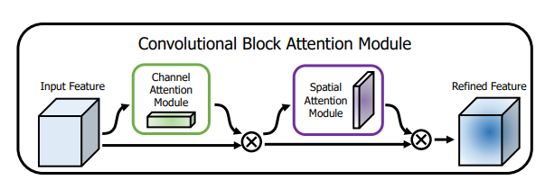
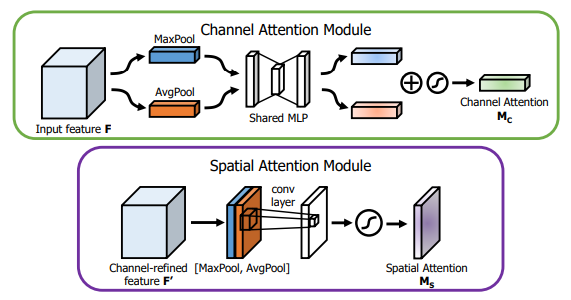
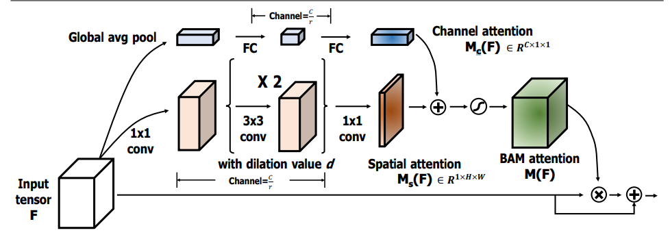
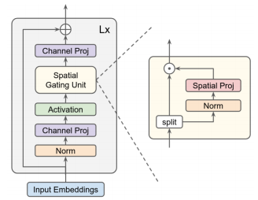

# Contents

- [Attention Series](#attention-series)
    - [1. External Attention Usage](#1-external-attention-usage)

    - [2. Self Attention Usage](#2-self-attention-usage)

    - [3. Simplified Self Attention Usage](#3-simplified-self-attention-usage)

    - [4. Squeeze-and-Excitation Attention Usage](#4-squeeze-and-excitation-attention-usage)

    - [5. SK Attention Usage](#5-sk-attention-usage)

    - [6. CBAM Attention Usage](#6-cbam-attention-usage)

    - [7. BAM Attention Usage](#7-bam-attention-usage)
    
    - [8. ECA Attention Usage](#8-eca-attention-usage)

- [MLP Series](#mlp-series)

    - [1. RepMLP Usage](#1-RepMLP-Usage)

    - [2. MLP-Mixer Usage](#2-MLP-Mixer-Usage)

    - [3. ResMLP Usage](#3-ResMLP-Usage)

    - [4. gMLP Usage](#4-gMLP-Usage)


***


# Attention Series

- Pytorch implementation of ["Beyond Self-attention: External Attention using Two Linear Layers for Visual Tasks"](https://arxiv.org/abs/2105.02358)

- Pytorch implementation of ["Attention Is All You Need---NIPS2017"](https://arxiv.org/pdf/1706.03762.pdf)

- Pytorch implementation of ["Squeeze-and-Excitation Networks---CVPR2018"](https://arxiv.org/abs/1709.01507)

- Pytorch implementation of ["Selective Kernel Networks---CVPR2019"](https://arxiv.org/pdf/1903.06586.pdf)

- Pytorch implementation of ["CBAM: Convolutional Block Attention Module---ECCV2018"](https://openaccess.thecvf.com/content_ECCV_2018/papers/Sanghyun_Woo_Convolutional_Block_Attention_ECCV_2018_paper.pdf)

- Pytorch implementation of ["BAM: Bottleneck Attention Module---BMCV2018"](https://arxiv.org/pdf/1807.06514.pdf)

- Pytorch implementation of ["ECA-Net: Efficient Channel Attention for Deep Convolutional Neural Networks---CVPR2020"](https://arxiv.org/pdf/1910.03151.pdf)

***


### 1. External Attention Usage
#### 1.1. Paper
["Beyond Self-attention: External Attention using Two Linear Layers for Visual Tasks"](https://arxiv.org/abs/2105.02358)

#### 1.2. Overview


#### 1.3. Code
```python
from attention.ExternalAttention import ExternalAttention
import torch

input=torch.randn(50,49,512)
ea = ExternalAttention(d_model=512,S=8)
output=ea(input)
print(output.shape)
```

***


### 2. Self Attention Usage
#### 2.1. Paper
["Attention Is All You Need"](https://arxiv.org/pdf/1706.03762.pdf)

#### 1.2. Overview


#### 1.3. Code
```python
from attention.SelfAttention import ScaledDotProductAttention
import torch

input=torch.randn(50,49,512)
sa = ScaledDotProductAttention(d_model=512, d_k=512, d_v=512, h=8)
output=sa(input,input,input)
print(output.shape)
```

***

### 3. Simplified Self Attention Usage
#### 3.1. Paper
[None]()

#### 3.2. Overview


#### 3.3. Code
```python
from attention.SimplifiedSelfAttention import SimplifiedScaledDotProductAttention
import torch

input=torch.randn(50,49,512)
ssa = SimplifiedScaledDotProductAttention(d_model=512, h=8)
output=ssa(input,input,input)
print(output.shape)

```

***

### 4. Squeeze-and-Excitation Attention Usage
#### 4.1. Paper
["Squeeze-and-Excitation Networks"](https://arxiv.org/abs/1709.01507)

#### 4.2. Overview


#### 4.3. Code
```python
from attention.SEAttention import SEAttention
import torch

input=torch.randn(50,512,7,7)
se = SEAttention(channel=512,reduction=8)
output=se(input)
print(output.shape)

```

***

### 5. SK Attention Usage
#### 5.1. Paper
["Selective Kernel Networks"](https://arxiv.org/pdf/1903.06586.pdf)

#### 5.2. Overview


#### 5.3. Code
```python
from attention.SKAttention import SKAttention
import torch

input=torch.randn(50,512,7,7)
se = SKAttention(channel=512,reduction=8)
output=se(input)
print(output.shape)

```
***

### 6. CBAM Attention Usage
#### 6.1. Paper
["CBAM: Convolutional Block Attention Module"](https://openaccess.thecvf.com/content_ECCV_2018/papers/Sanghyun_Woo_Convolutional_Block_Attention_ECCV_2018_paper.pdf)

#### 6.2. Overview




#### 6.3. Code
```python
from attention.CBAM import CBAMBlock
import torch

input=torch.randn(50,512,7,7)
kernel_size=input.shape[2]
cbam = CBAMBlock(channel=512,reduction=16,kernel_size=kernel_size)
output=cbam(input)
print(output.shape)

```

***

### 7. BAM Attention Usage
#### 7.1. Paper
["BAM: Bottleneck Attention Module"](https://arxiv.org/pdf/1807.06514.pdf)

#### 7.2. Overview


#### 7.3. Code
```python
from attention.BAM import BAMBlock
import torch

input=torch.randn(50,512,7,7)
bam = BAMBlock(channel=512,reduction=16,dia_val=2)
output=bam(input)
print(output.shape)

```


### 8. ECA Attention Usage
#### 8.1. Paper
["ECA-Net: Efficient Channel Attention for Deep Convolutional Neural Networks"](https://arxiv.org/pdf/1910.03151.pdf)

#### 8.2. Overview


#### 8.3. Code
```python
from attention.ECAAttention import ECAAttention
import torch

input=torch.randn(50,512,7,7)
eca = ECAAttention(kernel_size=3)
output=eca(input)
print(output.shape)

```


***

# MLP Series

- Pytorch implementation of ["RepMLP: Re-parameterizing Convolutions into Fully-connected Layers for Image Recognition"](https://arxiv.org/pdf/2105.01883v1.pdf)

- Pytorch implementation of ["MLP-Mixer: An all-MLP Architecture for Vision"](https://arxiv.org/pdf/2105.01601.pdf)

- Pytorch implementation of ["ResMLP: Feedforward networks for image classification with data-efficient training"](https://arxiv.org/pdf/2105.03404.pdf)


- Pytorch implementation of ["Pay Attention to MLPs"](https://arxiv.org/abs/2105.08050)

### 1. RepMLP Usage
#### 1.1. Paper
["RepMLP: Re-parameterizing Convolutions into Fully-connected Layers for Image Recognition"](https://arxiv.org/pdf/2105.01883v1.pdf)

#### 1.2. Overview


#### 1.3. Code
```python
from mlp.repmlp import RepMLP
import torch
from torch import nn

N=4 #batch size
C=512 #input dim
O=1024 #output dim
H=14 #image height
W=14 #image width
h=7 #patch height
w=7 #patch width
fc1_fc2_reduction=1 #reduction ratio
fc3_groups=8 # groups
repconv_kernels=[1,3,5,7] #kernel list
repmlp=RepMLP(C,O,H,W,h,w,fc1_fc2_reduction,fc3_groups,repconv_kernels=repconv_kernels)
x=torch.randn(N,C,H,W)
repmlp.eval()
for module in repmlp.modules():
    if isinstance(module, nn.BatchNorm2d) or isinstance(module, nn.BatchNorm1d):
        nn.init.uniform_(module.running_mean, 0, 0.1)
        nn.init.uniform_(module.running_var, 0, 0.1)
        nn.init.uniform_(module.weight, 0, 0.1)
        nn.init.uniform_(module.bias, 0, 0.1)

#training result
out=repmlp(x)
#inference result
repmlp.switch_to_deploy()
deployout = repmlp(x)

print(((deployout-out)**2).sum())
```

### 2. MLP-Mixer Usage
#### 2.1. Paper
["MLP-Mixer: An all-MLP Architecture for Vision"](https://arxiv.org/pdf/2105.01601.pdf)

#### 2.2. Overview


#### 2.3. Code
```python
from mlp.mlp_mixer import MlpMixer
import torch
mlp_mixer=MlpMixer(num_classes=1000,num_blocks=10,patch_size=10,tokens_hidden_dim=32,channels_hidden_dim=1024,tokens_mlp_dim=16,channels_mlp_dim=1024)
input=torch.randn(50,3,40,40)
output=mlp_mixer(input)
print(output.shape)
```


### 3. ResMLP Usage
#### 3.1. Paper
["ResMLP: Feedforward networks for image classification with data-efficient training"](https://arxiv.org/pdf/2105.03404.pdf)

#### 3.2. Overview


#### 3.3. Code
```python
from mlp.resmlp import ResMLP
import torch

input=torch.randn(50,3,14,14)
resmlp=ResMLP(dim=128,image_size=14,patch_size=7,class_num=1000)
out=resmlp(input)
print(out.shape) #the last dimention is class_num
```


### 4. gMLP Usage
#### 4.1. Paper
["Pay Attention to MLPs"](https://arxiv.org/abs/2105.08050)

#### 4.2. Overview


#### 4.3. Code
```python
from mlp.g_mlp import gMLP
import torch

num_tokens=10000
bs=50
len_sen=49
num_layers=6
input=torch.randint(num_tokens,(bs,len_sen)) #bs,len_sen
gmlp = gMLP(num_tokens=num_tokens,len_sen=len_sen,dim=512,d_ff=1024)
output=gmlp(input)
print(output.shape)
```